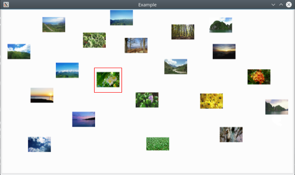

### The task

Write an application which shows images previews.
User can navigate using up, down, left, right keys.
Selected image should be highlighted by a red frame.

### Description

Near the executable file copy ["images"](https://github.com/go-maxus-go/RestreamTestTask/tree/master/images) directory with a few images .jpg images.

After launching the application it should load images from "images" directory
and randomly place images in the application's window. The window size is 1280x720.Images' size is 100x100. Images must be loaded asynchronously without lags.The application displays image when it is loaded.

Application should be based on Qt widgets.

### Example

